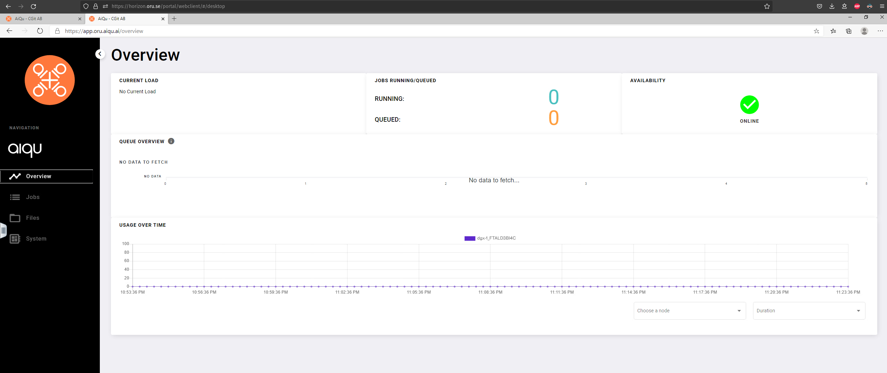

# oru-dgx

This repo is intended as a tutorial and workflow setup for the DGX Machine at Örebro University. Other than an oru.se account you won't need anything.
The goal of this tutorial is to enable you as quickly as possible to use the DGX Machine as your machine of choice to develop the newest GPU-heavy algorithms.
For the interested reader there is also a [user guide](./userguide_oru_dgx.pdf) you can read that has a stronger focus on deployment instead of development. Note that the user guide uses the terms Data Factory to refer to the DGX Machine. In this tutorial we will use the term Data Factory only to refer to the server that permanently stores data, which is separate from the DGX Machine where jobs are scheduled and the number crunching happens.
<!-- We will now go through the steps of setting up your account and installing all the necessary software for you to start using the DGX Machine. -->

## Getting the Necessary Accounts and Software

### 1. Getting an Account for the Data Factory and the DGX Machine

As of now, you have to contact the account manager of the Data Factory and the DGX Machine, Currently, this is [Andreas Persson](mailto:andreas.persson@oru.se) (14/08/2023). Write him a mail, he will fix you an account.

### 2. Setting Up Docker and Dockerhub
Your code on the DGX Machine will be running in Docker containers. It is a good idea to install the [docker-engine](https://docs.docker.com/engine/install/) on your local machine. It is also a good idea to additionally perform the [post-installation](https://docs.docker.com/engine/install/linux-postinstall/) when your local machine runs Linux. Do also create an account on [Dockerhub](https://hub.docker.com/). This allows you to build custom docker images upload them to Dockerhub and deploy them on the DGX Machine.

## Workflow

### 1. Build and Push Docker Image

First you will want to to build a docker image that has all the necessary dependencies for your project. In [docker](./docker) directory you can already find a docker file ready to be deployed on the DGX Machine (tested on 25/11/22). You can take this docker file and adapt to your needs. For instance, if you want to install additional Python packages simply modify the `requirements.txt` file or use the image as yout base image.

Here are the general steps to follow:

1. fire up a terminal type in the following command
    ```sh
    git clone https://github.com/pedrozudo/oru-dgx.git
    cd oru-dgx/docker 
    ```

2. Adapt the `build.sh` and the `push.sh` files by setting the variables.

3. Adapt the `Dockerfile` file and the `requirements.txt` file. (Optional: you can choose to install `tmux` in your docker image, reason and instructions have been described in section [Using `tmux`](#using-tmux))

4. Build the image:
```sh
./build.sh
```
5. Push the image to Dockerhub:
```sh
./push.sh
```
Note that you do not want to put your own code base in your docker image, we will take care of this later one. Simply consider the docker image as the operating system you want to run on the DGX Machine.


### 2. Mounting the Data Factory

Next you will want to mount your home directory on the Data Factory on to your local machine. First, create a directory on your local machine where you want to mount the remote directory to.
```sh
mkdir -p ~/mount/datafactory
```
Now you can simply use the following command to mount the remote directory onto your local machine ([sshfs](https://github.com/libfuse/sshfs) can be installed using `sudo apt install sshfs`). Note that you need to be on the oru.se network for this (either physically or via VPN).
```sh
sshfs username@10.1.115.65:/mnt/dgx_001/aiqu_data/users/username/ ~/mount/datafactory
```
Replace in the command above `username` with your oru.se username. The password will also be your oru.se password. You can verify whether the mount was successful by running `mount | grep sshfs` which should produce:
```
username@10.1.115.65:/mnt/dgx_001/aiqu_data/users/username/ on /mount/datafactory type fuse.sshfs (rw,nosuid,nodev,relatime,user_id=1000,group_id=1000)
```

You can now use the mounted directory to transfer your prototype code and data to the Data Factory from your local machine.

Note: if you have never logged in to the Data Factory, your personal directory does not exist yet. In this case you will first have to login using the webinterface. The steps are described in the next section. 

### 3. Running Code on the DGX Machine
 Let's assume you have some code and data in the `~/mount/datafactory/AGI` directory and you want to run your algorithm on the DGX Machine now. Here is what you have to to.

 1. Go to [horizon.oru.se](https://horizon.oru.se/portal/webclient/#/launchitems), look for `oru.aiqu.se` and login. You will end up in a dashboard looking like this:
 
 2. Click on the `Jobs` tab on the left and populate the following fields:
    - Job Label: just enter the name you want your job to have
    - Image: enter the docker image (on Dockerhub) you want to use, for instance, `pedrozudo/oru-dgx:torch-2.0.1`

    Also adjust the number of GPUs you need and for how long (in minutes) you want your job to be running. You can also expose ports (see the [user guide](./userguide_oru_dgx.pdf) for further details on this).

    Next, click on `Advanced Settings` and mount the `/Home Catalog/AGI` directory.

    You are now good to go. Click on `Queue Job` and wait for your job to be scheduled.

    Once this happens, open a terminal for your job (on the far right in the job list). List the files and directories (`ls`). Your project should now be in the `AGI` directory. You can cd into it and run your algorithm
    ```sh
    cd AGI
    python agi.py
    ```

3. You will probably have a bug or two in your code which you would like to fix. On your local machine, go to the `~/mount/datafactory/AGI/` directory and fix your bug. The cool thing is that both the `~/mount/datafactory/AGI/` directory on your local machine and the `/AGI/` directory on the DGX Machine were mounted from the same directory on the Data Factory. This means that changing a file on your local machine will be reflected within the running docker image on the DGX machine. You can now code away on the DGX Machine while using the comfort of your local setup.


## Using `tmux`
### Why?
The [horizon.oru.se](https://horizon.oru.se/portal/webclient/#/launchitems) interface allows opening a terminal for your job, but if that terminal is closed (accidentally, on purpose, or due to logout) the logs are lost and you can't "reconnect" to the previously open terminal. A workaround is to run your job inside a `tmux` _session_; even if the terminal is closed the `tmux` session lives on which you can _attach_ to. Head over to the [official tmux documentation](https://github.com/tmux/tmux/wiki) to learn more.

A neat `tmux` feature — it's after all a [terminal multiplexer](https://en.wikipedia.org/wiki/Terminal_multiplexer) — is that you can stack several terminals and switch between them through keyboard shortcuts, thus letting you have multiple terminals open at the same time. In `tmux` parlance, each terminal is a _window_ and multiple windows comprise a _session_. 
### How?
This section is a primer on how to get started with `tmux`. If there is any difference between what's here and the official documentation, the latter is correct (in which case please consider opening a PR with the correction).

#### How to install?
Installation via `apt` is the recommended way:
```
sudo apt update && sudo apt install tmux
```

In your `Dockerfile`, if you are already installing packages through `apt`, simply throw in `tmux` and it will get installed in your docker image.

#### How to use?
(a good video to start with is [Fireship: Tmux in 100 seconds](https://youtu.be/vtB1J_zCv8I))

Right when your docker image is spun up as a container on the DGX (i.e. right when your job starts), say you want a `tmux` session named `mysession` to start with three windows: **1)** `htop`, **2)** `watch -n1 nvidia-smi`, **3)** a regular terminal for you to do what you like. (It's possible to add more windows to an existing session)

Place the following command at the end your `Dockerfile` (make sure this is not overridden elsewhere):
```
CMD tmux new-session -d -s mysession \; \
    send-keys 'htop' C-m \; \
    new-window -t mysession:1 \; \
    rename-window 'nvidia-smi' \; \
    send-keys 'watch -n1 nvidia-smi' C-m \; \
    new-window -t mysession:2 \; \
    send-keys '/bin/bash' C-m \; \
    attach-session -t mysession
```

On [horizon.oru.se](https://horizon.oru.se/portal/webclient/#/launchitems), open up a terminal from your active job, and type `tmux ls`. This will list `mysession` as the session that is already running, which you can attach to with `tmux a`. To reiterate, the whole point of using `tmux` is that even if the terminal gets closed, the `tmux` session does not die so you can simply attach to the running session from a new terminal.

All keyboard shortcuts for interacting with a `tmux` session _start_ with `Ctrl + B` followed by the keybinding for the specific operation. The three main keybindings to remember are (`Ctrl + B` comes before _every_ one):
1. `W`: Brings up list of windows in the session. Use arrow keys to reach a window and hit `enter` to select it.
2. `0-9`: Directly brings up the window matching the index number without requiring to go to the list of windows first.
3. `[`: Activates scroll mode _inside a window_. Use up-down direction keys to scroll, and `Page Up/Down` to jump a page. Hit `q` to deactivate scroll mode.
